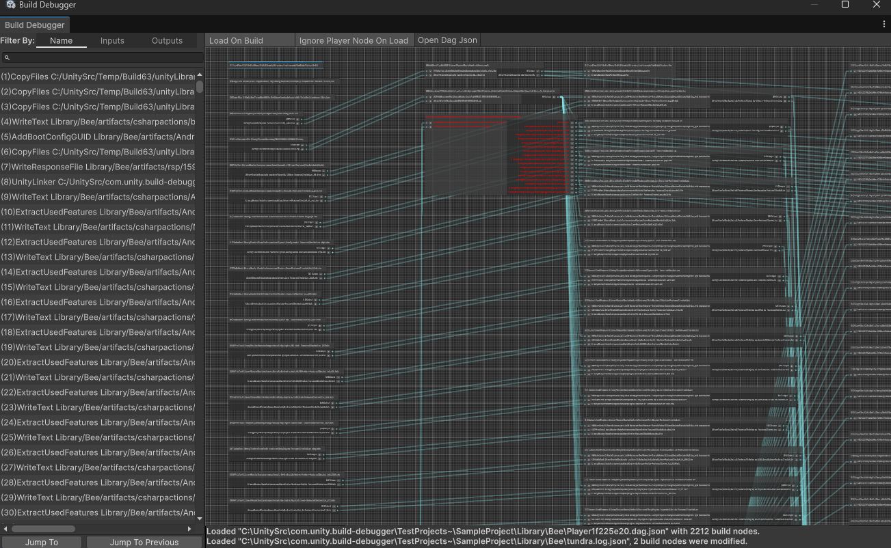
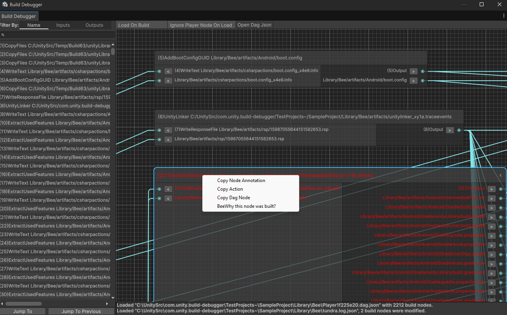
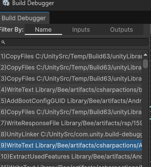
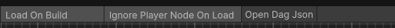
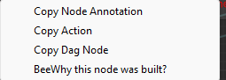
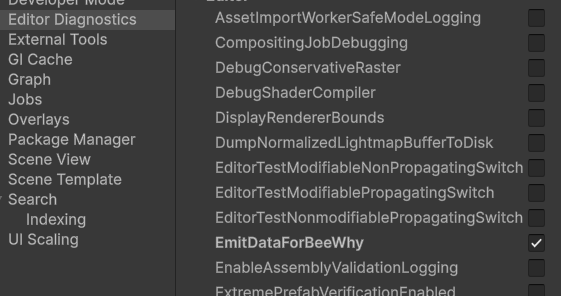
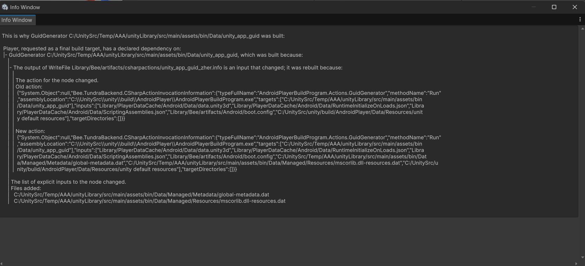
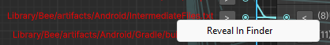

# Build Debugger for Unity

A utility for visualizing **.dag.json** files - which are produced by Unity when building a player. This utility also uses **bee why** command to provide more insights on why a specific node was built, which can be very useful when analyzing incremental builds.

### What is .dag.json?
When producing a build from Unity, a **unityproject\Library\Bee\Player____.dag.json** file is generated.
It represents the build graph used by incremental build pipeline, by inspecting dag nodes and their inputs/outputs, you can get a better understanding of the build process and how different nodes are connected to each other.


__Note:__ Graph visualization is done via **UnityEditor.Experimental.GraphView** API.






## Requirements

* [Git](https://git-scm.com/install/)
* Unity **6000.0.0f1** or higher  

## Installation

1. In Unity, open **Window → Package Manager**.  
2. In the top-left corner, click the **+** button and select **Install package from Git URL**.  
3. Enter the following HTTPS url:
   ```
   https://github.com/todi1856/com.unity.build-debugger.git
   ```

## Quick Start

1. The build debugger window can be opened via **Window → Analysis → Build Debugger**.
1. It will also open automatically when producing a build from Unity.

__Note__: By default, nodes are collapsed to minimize the graph, you can expand them by clicking on the arrow next to the node name or by double-clicking on the node.

## Navigation

On the left pane you can see the navigation window.



There are three ways to filter the nodes:
* By **Name** - by typing the name of the node in the search field.
* By **Input** - by typing the input of the node in the search field, any build nodes having the filtered input will be displayed in the list.
* By **Output** - by typing the output of the node in the search field, any build nodes having the filtered output will be displayed in the list.

Once you've selected a node, click **Jump To** to focus on the selected node in the graph view. You can then click on arrows next to input/output ports to navigate to other nodes.
By clicking **Jump To Previous** you can navigate to the previously selected node.

__Note:__ Nodes which were modified during the build will be highlighted in red.

## Other options 



* **Load On Build** - when enabled, the build debugger will automatically load the .dag.json file after a build is produced.
* **Ignore Player Node On Load** - when enabled, the build debugger will ignore the player node when loading the .dag.json file. This is useful when you want to analyze the build without the player node, which can be very large and can cause graph to be harder to view.
* **Open Dag Json** - manually open the .dag.json, unlike the automatic loading, this option will not load tundra.log.json, thus build debugger doesn't know which nodes were modified during the build.

## Context Menu (Nodes)



Right-clicking on a node in the graph view will open a context menu with the following options:
* **Copy Node Annotation** - copies the annotation of the node to the clipboard.
* **Copy Action** - copies the action of the node to the clipboard, if there is one.
* **Copy Dag Node** - copies the entire DAG node information to the clipboard in JSON format.
* **BeeWhy this node was built?** - executes the command `bee why <node name>` in the terminal and displays the output in a new window. This option is only available for nodes which were modified during the build. 
    * __Note:__ The EmitBeeWhy diagnostics switch must be enabled before producing the build.



If done correct **bee why** will print the following information:


## Context Menu (Ports)


Right-clicking on an input/output port in the graph view will open a context menu with the following options:
* **Reveal In Finder** - reveals the file in the file explorer.